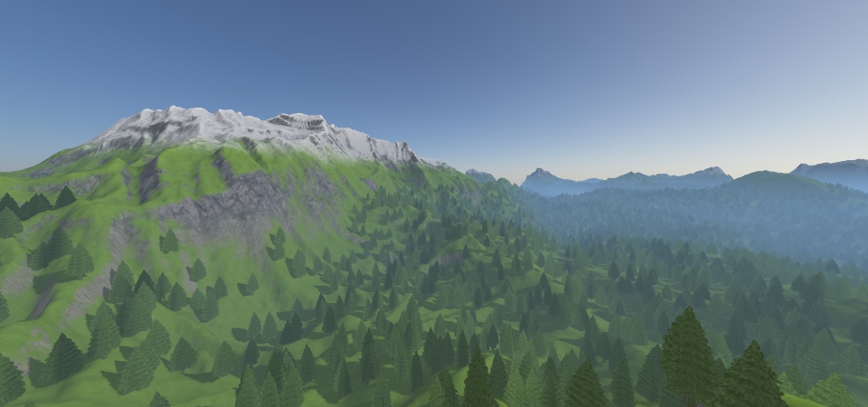

# terraingen
Procedural 3D terrain generator using the [fastnoise library](https://github.com/Auburns/FastNoise).

## How to build

### Required libraries

* [GLEW](http://glew.sourceforge.net/)
* [SDL2](https://www.libsdl.org/index.php)
* [GLM](https://glm.g-truc.net/0.9.9/index.html)

